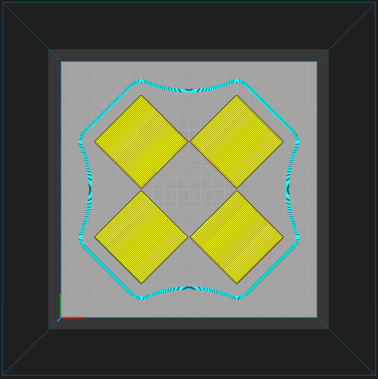

# Calibration

## Squaring the bed to the frame

1. Attach bed with knobs
   1. Turn knobs until finger snug
   1. Turn all knobs one full turn CCW
      - ⤴️ CCW lowers the bed
      - ⤵️ CW raises the bed
      - Like a volume knob for a stereo
1. Find home position Z offset
   1. This is the difference between
      - What the probe measures as 0.00 mm
      - Where the nozzle touches the bed
   1. Set Z offset to 0.00
      - Screen :: Prepare :: 🔆 Z-offset
   1. Auto home
      - Screen :: Prepare :: 🎯 Auto home
   1. Move nozzle to Z = 0.00
      - Screen :: Prepare :: 💠 Move :: Move Z
   1. Adjust Z offset until nozzle catches a sheet of paper
      - Screen :: Prepare :: 🔆 Z-offset
   1. `M114` should report `X:157.00 Y:122.00 Z:0.00 E:0.00`
   1. Redo this when the distance between probe and nozzle changes:
      - Changing nozzles
      - Replacing the probe
      - Repositioning the probe
1. Auto home
   - Screen :: Prepare :: 🎯 Auto home
   - Redo this when the physical Z = 0.00 position moves:
     - Turning knobs to reshape the bed when leveling it
1. Physically level the print bed
   1. Move nozzle along X and Y to each of the four knobs
      - `G0 Z3 X30  Y35`
      - `G0 Z3 X200`
      - `G0 Z3      Y208`
      - `G0 Z3 X30`
   1. Move nozzle down until Z = 0.00 or it touches the bed
   1. Track the knob with the highest bed position
   1. Turn the highest knob CCW to lower the bed until nozzle catches a sheet of paper when Z = 0.00
   1. Auto home and repeat until the bed settles to within 0.5 mm
   1. Goal: all five touch points, center and knobs, catch a piece of paper when Z = 0.00
1. Print some test patterns looking for first layer consistency
   - Circles and rectangles show high and low spots fairly well
   - If you make further knob adjustments, periodically auto home to remove the accumulated drift from the machine's new physical shape
   - Continue adjusting the knobs until the shapes print cleanly for their first two layers
   - If the layers are getting close but are not quite good enough, you can start a print in the problem area of the bed and _carefully_ adjust the closest knobs _live_, while the printer is running.
   - 

## Finding extruder steps per mm

1. Remove the nozzle so filament can pass through the hotend
1. Enable cold extrusions
1. Take an extrusion measurement
   1. Extrude 10 mm of filament
   1. Mark the filament at the exit of the heater block
   1. Extrude 100 mm of filament
   1. Mark the filament at the exit of the heater block
   1. Extrude 10 mm of filament
   1. Cut the filament at the exit of the heater block
   1. Measure the distance between the marks
1. Calculate the new steps per mm
   - `new_e_steps = old_e_steps * (100 / measured_filament_length)`
1. Update and reflash the firmware
1. Do another 10mm-mark-100mm-mark-10mm extrusion measurement
1. Adjust `new_steps` until an extrusion of 100mm yields 100mm of filament

## Finding PID coefficients for heaters

Marlin firmware has a built-in [command for tuning PID coefficients](https://marlinfw.org/docs/gcode/M303.html).

1. Tune the hotend with `M303 E0 C5 S200`
1. Tune the bed with `M303 E-1 C5 S75`
